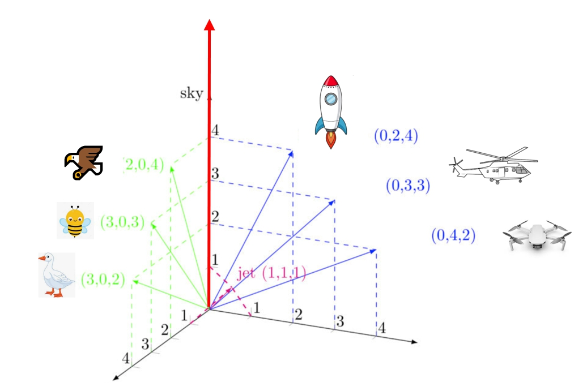
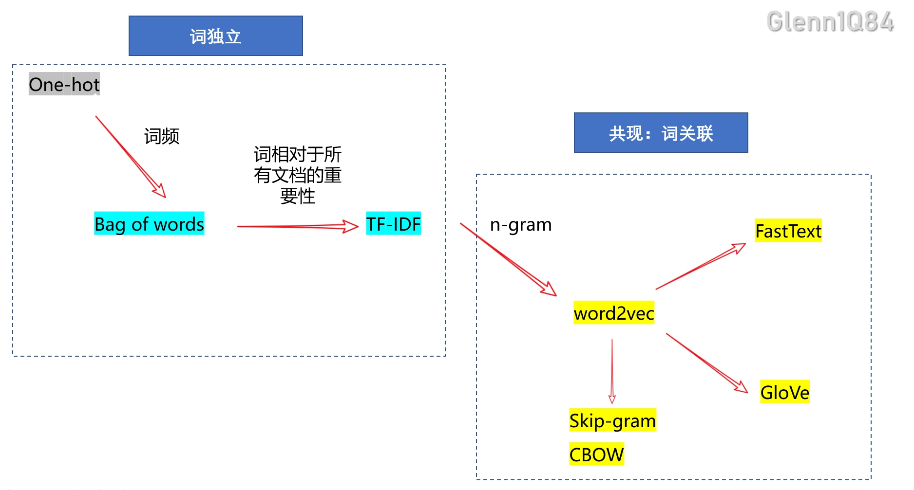
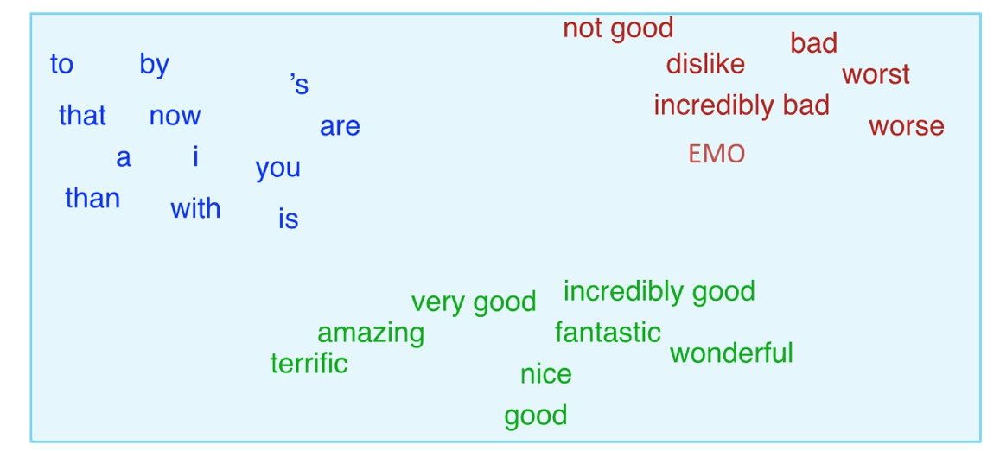

# 1. 什么是词嵌入(word embedding)

将词/字符转化为有意义可计算的数值。比如有两组词{蜜蜂，鹅，鹰}，{直升机，无人机，火箭}，用具有意义的数值（**具有词义**）来表示他们。

**怎样才算有词义呢？合乎现实的假设：飞得高的东西对应的数值大。**比如在天空（sky）这个维度上，{蜜蜂，鹅，鹰}数值从小到大依次是 鹅=2→蜜蜂=3→鹰=4;{直升机，无人机，火箭}数值从小到大依次是 无人机=2→直升机=3→火箭=4

# 2. 问题导向：为什么需要词嵌入？-以情感分析任务为例

事实上NLP的大多任务（如事件抽取、自动问答、语义角色标注）都需要词嵌入，在这里以一个**情感分析**任务为例

**句子**：我的脚打羽毛球**骨折**了，国庆期间只能**孤独**的呆宿舍，我**EMO**了。

**目标**：对该句子进行情感分类，正向或负向

**5G plus+pro超强人脑**: 一眼看到了 骨折、孤独、EMO，很明显这是负向的嘛

为什么你会觉得这几个词的情感是负向的呢？大脑是不是有一个词典存储着词的情感属性数值呢？比如(骨折：-0.5、孤独:-0.6、EMO:-0.4、YYDS：+0.7)

**怎么让机器理解呢？**将句子中的情感词数学化，使得机器能够进行计算

1. 抽出这几个词：骨折、孤独、EMO
2. 查看情感词典X，情感词典存储着每个词对应的情感值，比如X= {(”骨折“:x1)，(”孤独“: x2)，(”EMO“: x3)，...... , （wordN,xN )}，N为词典中所有词的数量
3. 对情感词做加权平均，大于等于0为正向情感、小于0为负向情感

$$
y = (x1+x2+x3)/3
$$

$$
label=\begin{cases} 1，y\geq0\\ -1， y<0\end{cases}
$$

**X是怎么获取的呢？**

​	**获取X的过程=词嵌入的过程**

# 3. 词嵌入的核心思想(intuition)是什么？

<<<<<<< HEAD

=======

>>>>>>> 808b9db2d26870a905b414e0e5a4264e52172557

## 词嵌入的重要假设：

**最合乎直觉（intuition）的假设-分布假设：相似的词往往出现在同一环境中（例如，在眼睛或检查等词附近）。**出现在非常**相似的分布**（其相邻的词是**相似**的）中的两个词具有相似的含义

**相似的分布**：周围词在 **词性、词义等**方面上类似

- 给出句子：“我颓废了”、“我抑郁了”、“我傻了”、“我非主流了”，**代词+X+语气词**
- 颓废、抑郁、
- **我emo了，其中”EMO“是啥意思？**

相似的词是 "在语义空间中是邻近的"，如下图所示：正向词在一堆，负向词（bad,worst。。。）在一堆，没有实意的词在一堆(is,to,by)

当你看懂这个假设，也就意味着你已经是一个词嵌入intuition的理论大师了 

